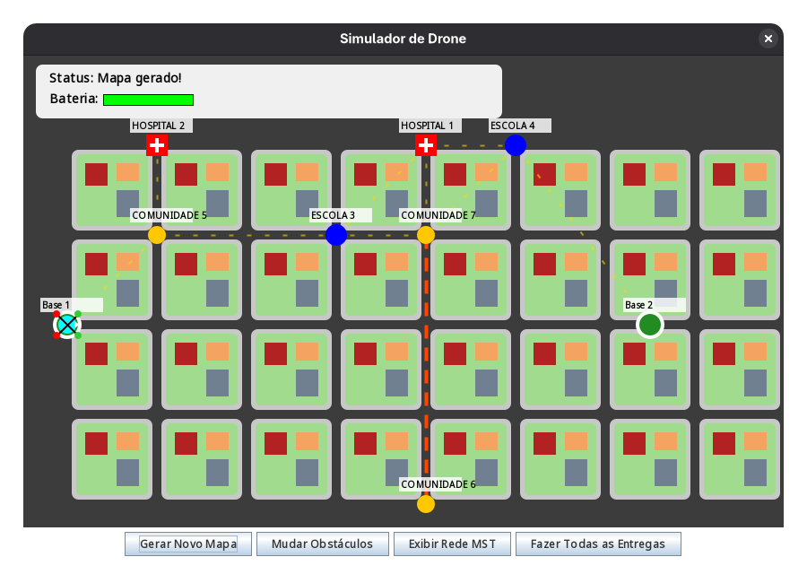
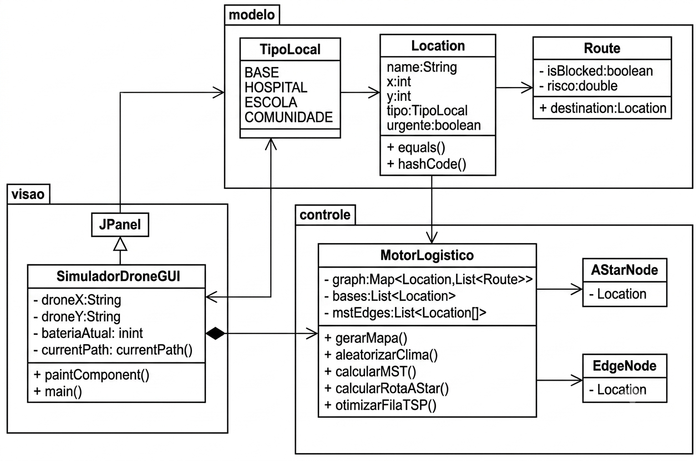

# Simulador de Drone

O sistema é uma simulação visual interativa desenvolvida em Java (Swing) que modela a logística de entrega por drones em um ambiente urbano. O objetivo principal é demonstrar a aplicação prática de algoritmos clássicos da Teoria dos Grafos em um cenário de roteamento com restrições físicas (bateria) e prioridades de negócio (urgência médica).

## Modelagem
1. **Vértices (Nós)**: Representam os pontos de interesse geográficos. Eles são tipados em quatro categorias: *BASE* (Centros de distribuição), *HOSPITAL* (Prioridade alta/Urgência), *ESCOLA* e COMUNIDADE;

2. **Arestas (Rotas)**: Representam os caminhos navegáveis entre os locais;

3. **Pesos (Custos)**: O custo de travessia não é apenas a distância espacial, mas sim a Distância Euclidiana multiplicada por um Fator de Risco;

## Capturas de Tela

 

## Algoritmos Implementados

| Algoritmo |Aplicação no Sistema | Objetivo | 
| :--- | :---: | :--- |
| (A-Star)* | Navegação | Encontrar o caminho mais barato (menor custo de distância + risco) entre o ponto 
| Heurística TSP | Organização da Fila de Entregas. | Usa o método do *"Vizinho Mais Próximo"* para evitar que o drone cruze a cidade desnecessariamente.
Prim (MST) | Geração do Mapa e Análise de Rede. | Cria a estrutura da cidade, garantindo que todos os pontos estejam conectados com a menor quantidade de rotas possível. |

### Diagrama de classes

### Funcionalidades e Regras
**Gestão de Múltiplas Bases**: O sistema possui duas bases em extremos opostos. O drone calcula constantemente qual base está mais próxima para realizar pousos de emergência ou reabastecimento;

**Priorização Hospitalar**: Independentemente da distância, os nós marcados como *HOSPITAL* (urgentes) são sempre visitados primeiro;

**Margem de Segurança de Bateria**: Ele só decola se a bateria for suficiente para cobrir o trajeto com uma margem de segurança de 20%;

**Clima Dinâmico**: O sistema permite bloquear instantaneamente uma rota ativa (simulando tempestades ou acidentes).
